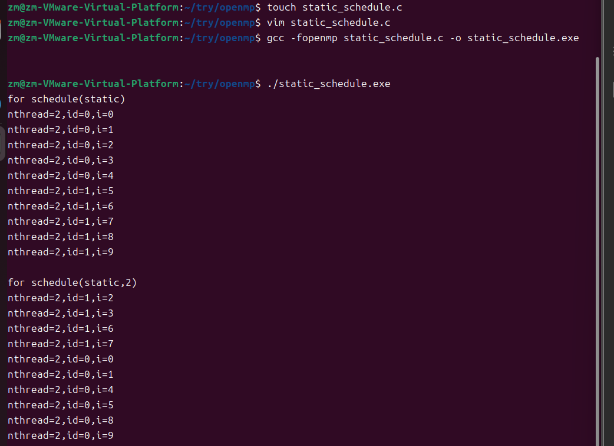

# 并发 #
- 并发性是指**两个或多个事件**在同一时间**间隔**内发生，实质是物理CPU在若干个程序之间多路复用。
- 并发性是对有限的物理资源强制行驶多用户共享以提高效率
- 将CPU分隔开，在一个任务工作时，其他任务是挂起的状态
# 并行 #
- 并行是指两个或多个事件在**同一时刻**发生
- 多个程序在同一时刻，不同CPU上同时执行
# 并行VS并发 #
- 并发是同一个时间段内，而并行是同一时刻
- **并发**是多个任务复用**单个CPU**，而**并行**是多个任务在**多个CPU**上执行
# 并行计算 #
- 并行计算（Parallel Computing）是指同时使用多种计算资源解决计算问题的过程，是提高计算机系统计算速度和处理能力的一种有效手段。它具有**强大的数值计算和数据处理能力**
- 并行计算分为时间上的并行，空间上的并行
# 进程 #
- 狭义上，进程是正在运行的程序的实例。
- 广义上，进程是具有一定**独立功能**的程序关于某个数据集合上的一次运行活动，是系统进行资源分配和调度的一个独立单位。
# 线程 #
- 线程是操作系统能够进行运算调度的**最小单位**。
- 线程被包含在进程之中，是进程中的实际运作单位
- 一条线程指的是进程中一个单一顺序的控制流
- **一个进程中可以并发多个线程**，每条线程并行执行不同的任务
- 同一进程中的多条线程将**共享**该进程中的全部系统资源，如虚拟地址空间，文件描述符和信号处理等等。但同一进程中的多个线程有各自的调用栈，自己的寄存器环境，自己的线程本地存储
# 超线程 #
- 超线程技术把多线程处理器内部的两个逻辑内核模拟成两个物理芯片，让**单个处理器就能使用线程级的并行计算**，进而兼容多线程操作系统和软件。
- 超线程技术充分利用空闲CPU资源，在相同时间内完成更多工作。
- 虽然采用超线程技术能够**同时执行两个线程**，**当两个线程同时需要某个资源时**，其中一个线程必须让出资源暂时挂起，直到这些资源空闲以后才能继续。因此，超线程的性能并不等于两个CPU的性能。而且，超线程技术的CPU需要芯片组、操作系统和应用软件的支持，才能比较理想地发挥该项技术的优势。
进程包括线程，每个线程有自己的空间，运行规则
# MPI和OpenMP #
- MPI与OpenMP是**并行计算**领域中最为流行的编程模型。
- MPI主要针对粗粒度级别的并行，主要应用在**分布式计算机**上，即将任务分配给集群中**所有计算机**上。
- OpenMP主要针对细粒度的循环进行并行，即在循环中将每次循环分配给**不同的线程**去执行，主要应用于**一台独立的服务器或计算机**上。由于使用线程间共享内存的方式协调并行计算，它在多核/多CPU结构上的效率很高、内存开销小、编程语句简洁直观，因此编程容易、编译器实现也容易（现在最新版的C、C++、Fortran编译器基本上都内置OpenMP支持）
# OpenMP #
- OpenMP是一种**面向共享内存的多线程并行编程接口**
- 特点：
  1. 实现程序结构快的并行化和向量化
  2. 在并行区域，各个子线程拥有各自的私有变量，其他线程不能访问。全部线程均可对共享变量进行读写操作
- OpenMP由**编译指导语句、库函数和环境变量**三部分组成。其指导思想是将**工作划分为多个子任务分配给多个线程**，从而实现多核并行处理单一的地址空间。其中，编译指导语句是串行代码实现并行化的桥梁，是编写OpenMP应用程序的关键。但是**编译指导语句**的优势仅体现在**编译阶段**，对运行阶段的支持较少。因此，编程人员需要利用**库函数**这个重要工具在**程序运行阶段**改变和优化并行环境从而控制程序的运行。而**环境变量**则是库函数控制函数运行的一些具体参数
## 编译指导语句 ##
格式：`#pragma omp <directive>[clause[[,]clause]...]`
- directive部分是编译指导语句的主要指令，用来指导多个CPU共享任务或指导多个CPU同步
- clause部分是*可选*的子句，它给出了相应的指令参数，可以影响到编译指导语句的具体执行
注意：**换行符是必选项**。位于被这个指令包围的结构块之前，表示这条编译指导语句的终止。<即在编译语句结束后需要输入换行符>
- `<directive>`: 
     
|  指令  |   作用   |    
|----------|--------|    
| parallel |用在一个结构块之前，表示这段代码将被多个线程并行执行 |   
| for   |用于for循环语句之前，表示将循环计算任务分配到多个线程中并行执行，以实现任务分担，但必须保证每次循环之间无数据相关性|       
|sections |用在要被并行执行的代码段之前，用于实现多个结构块语句的任务分担，可并行执行的代码段各自用section指令标出<sections  vs  section>|     
|critical |用在一段代码临界区前，保证每次只有**一个openmp线程**进入|    
|single |用在并行域内，表示一段只**被单个进程执行**的代码 |    
|flush | 保证各个openmp线程的数据影像的一致性|     
|barrier|  用于并行域内代码的**线程同步**，线程执行到barrier时要停下等待，直到**所有线程都执行到barrier时才继续往下执行**|
- `[clause]`:   
   
|指令   |作用     |    
|----------|--------|    
| private | 指定一个或多个变量在每个线程中都有它自己的**私有副本**|    
|shared  | 指定一个或多个变量为多个线程间的**共享变量**|   
|default | 用来指定并行域内的变量的使用方式，缺省是shared|    
|firstprivate| 指定一个或多个变量在每个线程都有它自己的**私有副本**，并且私有变量要在进入并行域或任务分担域时，继承主线程中的**同名变量**的值作为初值|       
|lastprivate| 是用来指定将线程中的一个或多个私有变量的值在**并行处理结束后复制到主线程中的同名变量**中，负责拷贝的线程是for或sections任务分担中的最后一个线程 |   
|reduction |用来指定一个或多个变量是私有的，并且在并行处理结束后这些变量要执行指定的归约运算，并将结果返回给主线程同名变量 |     
|copyin |用来指定一个threadprivate类型的变量需要用主线程同名变量进行初始化|   
### 部分指令格式 ###
1. `private(变量列表)`
2. `shared(变量列表)`
3. `default(shared)` /`default(none)`
4. `reduction(运算符：变量列表)`//reduction支持：`+ - * / += -= *= /= |&^`
## 头文件 ##
当在Linux系统中使用C/C++编译器时，要通过以下方式包含OpenMP头文件：
` #include <omp.h> `
## 库函数 ##
OpenMP提供的库函数可分为三种：运行时环境函数、锁函数和时间函数。常用的OpenMP库函数如下：

| 函数名 | 功能 |
|--------|-------|      
| omp_in_parallel |判断当前**是否在并行域**中|     
| omp_set_num_threads| **设置**后续并行域中的**线程数量** |   
| omp_get_num_procs| 返回计算系统中**处理器的个数** |       
| omp_get_num_threads |返回当前并行域中的**线程数**|    
| omp_get_thread_num |返回当前的**线程号** |   
| omp_get_max_threads |返回当前并行域中可用的**最大线程数** |    
| omp_get_dynamic | 判断是否支持动态改变线程数量 |  
| omp_set_dynamic |启用或关闭线程数量的动态改变 |   
| omp_init_lock| 初始化一个简单锁 |  
| omp_set_lock |给一个简单锁上锁 |  
| omp_unset_lock| 给一个简单锁解锁 |  
| omp_destroy_lock| 关闭一个锁并释放内存|  
| omp_get_wtime |相对于某个任意参考时刻而言已经经历的时间| 
## 变量作用域 ##
 

# try #
 
 
  如果一个程序没有运行，就没有对应的进程
  超线程可以利用芯片进行多线程处理（并发）

# openmp并行编程-调度策略
1. schedule调度：`schedule(type,size)`
   常用的调度类型有：静态调度`static`，动态调度`dynamic`，指导性调度`guided`，运行调度`runtine`
2. static:在没有设定size的时候，会平均分配迭代次数
   共两个线程，10次循环次数，会给第一个线程分配1-5，第二个线程分配6-10
   若是设定了size，如size=2；则会轮流进行分配，线程0：1-2线程1：3-4；线程0：5-6；。。。。
```C
#include<stdio.h>
#include<omp.h>
int main()
{
       int nthreads,tid,i;
omp_set_num_threads(2);
printf("for schedule(static)\n");
#pragma omp parallel for private(i) schedule(static)
for(i=0;i<10;i++)
{
        nthreads=omp_get_num_threads();
        tid=omp_get_thread_num();
        printf("nthread=%d,id=%d,i=%d\n",nthreads,tid,i);
}
printf("\n");
printf("for schedule(static,2)\n");
#pragma omp parallel for private(i) schedule(static,2)
for(i=0;i<10;i++)
{
        nthreads=omp_get_num_threads();
        tid=omp_get_thread_num();
         printf("nthread=%d,id=%d,i=%d\n",nthreads,tid,i);
}
return 0;
}
```

3. 动态调度：dynamic
   动态的进行分配，当一个进程空闲了，就给他分配进程
```C
#include<stdio.h>
#include<omp.h>
int main()
{

       omp_set_num_threads(3);
#pragma omp parallel for  schedule(dynamic)
for(int i=0;i<22;i++)
{

printf("tid=%d,i=%d\n",omp_get_thread_num(),i);
}
return 0;
}
```
4. 指导性调度
指导性调度与动态调度方式类似，但是块的大小一开始比较大，后来逐渐减小，从而减小了线程访问队列的时间。
5. 运行时调度
运行时调度并不是和前面三种调度方式相似的真正调度方式，它是在运行过程中根据环境变量`OMP_SCHEDULE`来确定调度的类型。运行时调度的实现仍然是上述三种调度方式中的一种。
结合编译完成后在命令行输入：`export OMP_SCHEDULE="type,size"`
6. 分配调度次数要根据**每一次的迭代计算量**来合理的进行分配
调度选择：
- 如果循环的每次迭代需要几乎相同的计算量，那么可能默认的调度方式能提供最好的性能。
- 如果随着循环的进行，迭代的计算量线性递增（或线性递减），那么采用static调度可能会提供最好的性能。
- 如果每次迭代的开销事先不能确定，那么可能需要尝试使用多种不同的调度策略。这种情况下，应当使用`schedule(runtime)`子句，通过赋予环境变量`OMP_SCHEDULE`不同的值来比较不同调度策略下程序的性能。
# 数据安全
- 同步：保证各个线程不会同时访问共享资源，或者保证在开始新工作前已经完成共享资源的准备工作
  - 两种线程同步机制：
    1. 互斥锁：临界区`critical`,原子操作`atomic`,库函数-锁函数 
    2. 事件同步：同步栅障包括：显示同步栅障`barrier`,隐式同步栅障
- `barrier`
  并行区域中的所有线程在此处同步等待其他线程
  `#pragma omp barrier`
- `critical`
指令critical包含的代码块称为临界块或者critical结构。在执行上述临界块之前，必须先获得临界块的控制权，这样通过编译指导语句可以对存在数据竞争的并行区域内的变量进行保护。
指令critical的语法格式如下：
```C
#pragma omp critical(名称)
{
    代码块
}
```
名称是可选项。在一个程序中，可以存在多个critical区域。critical区域名称是全局标志符，不同名称代表不同的critical区域。具有相同名称的不同critical区域被当作同一个区域。所有未命名的critical区域被当作同一个区域。
注意：
（1）同一时间内只允许有一个线程执行critical结构
（2）指令critical不允许相互嵌套
（3）critical结构内部不允许出现能够到达critical结构之外的跳转语句，不允许有外部的跳转语句到达critical结构内部。
- `atomic`
指令atomic要求一个特定的内存地址必须自动更新，而不让其他线程对此内存地址进行写操作。指令atomic在语法上可以认为等价于critical，但指令critical对一个代码块有效，而atomic指令只对一个表达式语句有效。
指令atomic的语法格式如下：
```C
#pragma omp atomic
表达式
```
作用范围是指令atomic后面的第一个表达式语句，并要求该表达式语句是一个单独的能够立即被执行的语句。此表达式可以采用如下形式：x++、x--、++x、--x等。
|参数| 意义| 表达式|    
|----|-----|------|    
|read |读数据| v = x|     
|write |写数据 |x = expr|         
|update |更新数据 |x++; ++x; x--; --x; x binop = expr; x = x binop expr; x = expr binop x; |      
|capture |交换数据| v = x++; v = ++x; v = x--; v = --x; v = x binop = expr; x = x binop expr; x = expr binop x; |      
表：指令atomic中的子句和表达式   
- 事件同步
事件同步机制与并行区域中的隐式栅障密切相关。每个并行区域都会有一个隐含的同步栅障，同步栅障要求所有的线程同时执行到此栅障后才能继续执行下面的代码。
下列OpenMP结构结束处存在隐含的栅障barrier：
```C
pragma omp parallel
pragma omp for
pragma omp sections
pragma omp critical
pragma omp single
```
- 指令critical、指令atomic和锁的比较
1. 三种机制都可以实现对临界区的访问。
2. 一般而言，atomic指令是实现互斥访问最快的方法。
3. 而未命名的critical指令可以对程序中所有atomic指令标记的临界区进行强制互斥访问。
4. 当程序中有多个不同的由atomic指令保护的临界区时，应使用命名的critical指令或者锁。
5. 锁机制适用于需要互斥的是某个数据结构而不是代码块的情况。
6. OpenMP实现中，使用critical指令保护临界区与使用锁保护临界区在性能上没有太大的差别。故而，若无法使用atomic指令、却能使用critical指令时，我们应该使用critical指令。
注意要点
1. 对同一个临界区不应混合使用不同的互斥机制；
2. 互斥执行并不保证公平性；
3. “嵌套”互斥结构可能会导致产生死锁等的情况；