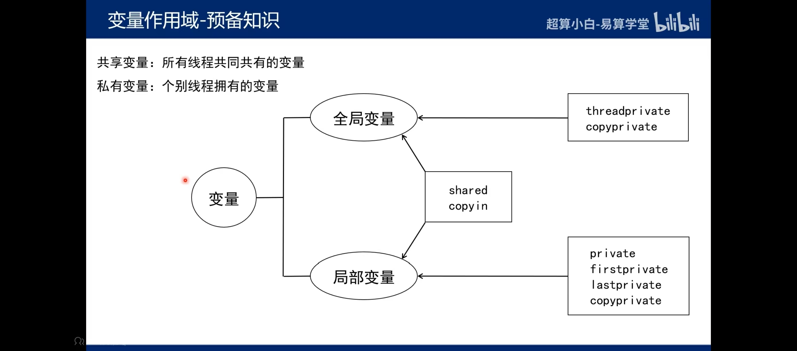

# 并发 #
- 并发性是指**两个或多个事件**在同一时间**间隔**内发生，实质是物理CPU在若干个程序之间多路复用。
- 并发性是对有限的物理资源强制行驶多用户共享以提高效率
- 将CPU分隔开，在一个任务工作时，其他任务是挂起的状态
# 并行 #
- 并行是指两个或多个事件在**同一时刻**发生
- 多个程序在同一时刻，不同CPU上同时执行
# 并行VS并发 #
- 并发是同一个时间段内，而并行是同一时刻
- **并发**是多个任务复用**单个CPU**，而**并行**是多个任务在**多个CPU**上执行
# 并行计算 #
- 并行计算（Parallel Computing）是指同时使用多种计算资源解决计算问题的过程，是提高计算机系统计算速度和处理能力的一种有效手段。它具有**强大的数值计算和数据处理能力**
- 并行计算分为时间上的并行，空间上的并行
# 进程 #
- 狭义上，进程是正在运行的程序的实例。
- 广义上，进程是具有一定**独立功能**的程序关于某个数据集合上的一次运行活动，是系统进行资源分配和调度的一个独立单位。
# 线程 #
- 线程是操作系统能够进行运算调度的**最小单位**。
- 线程被包含在进程之中，是进程中的实际运作单位
- 一条线程指的是进程中一个单一顺序的控制流
- **一个进程中可以并发多个线程**，每条线程并行执行不同的任务
- 同一进程中的多条线程将**共享**该进程中的全部系统资源，如虚拟地址空间，文件描述符和信号处理等等。但同一进程中的多个线程有各自的调用栈，自己的寄存器环境，自己的线程本地存储
# 超线程 #
- 超线程技术把多线程处理器内部的两个逻辑内核模拟成两个物理芯片，让**单个处理器就能使用线程级的并行计算**，进而兼容多线程操作系统和软件。
- 超线程技术充分利用空闲CPU资源，在相同时间内完成更多工作。
- 虽然采用超线程技术能够**同时执行两个线程**，**当两个线程同时需要某个资源时**，其中一个线程必须让出资源暂时挂起，直到这些资源空闲以后才能继续。因此，超线程的性能并不等于两个CPU的性能。而且，超线程技术的CPU需要芯片组、操作系统和应用软件的支持，才能比较理想地发挥该项技术的优势。
进程包括线程，每个线程有自己的空间，运行规则
# MPI和OpenMP #
- MPI与OpenMP是**并行计算**领域中最为流行的编程模型。
- MPI主要针对粗粒度级别的并行，主要应用在**分布式计算机**上，即将任务分配给集群中**所有计算机**上。
- OpenMP主要针对细粒度的循环进行并行，即在循环中将每次循环分配给**不同的线程**去执行，主要应用于**一台独立的服务器或计算机**上。由于使用线程间共享内存的方式协调并行计算，它在多核/多CPU结构上的效率很高、内存开销小、编程语句简洁直观，因此编程容易、编译器实现也容易（现在最新版的C、C++、Fortran编译器基本上都内置OpenMP支持）
# OpenMP #
- OpenMP是一种**面向共享内存的多线程并行编程接口**
- 特点：
  1. 实现程序结构快的并行化和向量化
  2. 在并行区域，各个子线程拥有各自的私有变量，其他线程不能访问。全部线程均可对共享变量进行读写操作
- OpenMP由**编译指导语句、库函数和环境变量**三部分组成。其指导思想是将**工作划分为多个子任务分配给多个线程**，从而实现多核并行处理单一的地址空间。其中，编译指导语句是串行代码实现并行化的桥梁，是编写OpenMP应用程序的关键。但是**编译指导语句**的优势仅体现在**编译阶段**，对运行阶段的支持较少。因此，编程人员需要利用**库函数**这个重要工具在**程序运行阶段**改变和优化并行环境从而控制程序的运行。而**环境变量**则是库函数控制函数运行的一些具体参数
## 编译指导语句 ##
格式：`#pragma omp <directive>[clause[[,]clause]...]`
- directive部分是编译指导语句的主要指令，用来指导多个CPU共享任务或指导多个CPU同步
- clause部分是*可选*的子句，它给出了相应的指令参数，可以影响到编译指导语句的具体执行
注意：**换行符是必选项**。位于被这个指令包围的结构块之前，表示这条编译指导语句的终止。<即在编译语句结束后需要输入换行符>
- `<directive>`: 
     
|  指令  |   作用   |    
|----------|--------|    
| parallel |用在一个结构块之前，表示这段代码将被多个线程并行执行 |   
| for   |用于for循环语句之前，表示将循环计算任务分配到多个线程中并行执行，以实现任务分担，但必须保证每次循环之间无数据相关性|       
|sections |用在要被并行执行的代码段之前，用于实现多个结构块语句的任务分担，可并行执行的代码段各自用section指令标出<sections  vs  section>|     
|critical |用在一段代码临界区前，保证每次只有**一个openmp线程**进入|    
|single |用在并行域内，表示一段只**被单个进程执行**的代码 |    
|flush | 保证各个openmp线程的数据影像的一致性|     
|barrier|  用于并行域内代码的**线程同步**，线程执行到barrier时要停下等待，直到**所有线程都执行到barrier时才继续往下执行**|
- `[clause]`:   
   
|指令   |作用     |    
|----------|--------|    
| private | 指定一个或多个变量在每个线程中都有它自己的**私有副本**|    
|shared  | 指定一个或多个变量为多个线程间的**共享变量**|   
|default | 用来指定并行域内的变量的使用方式，缺省是shared|    
|firstprivate| 指定一个或多个变量在每个线程都有它自己的**私有副本**，并且私有变量要在进入并行域或任务分担域时，继承主线程中的**同名变量**的值作为初值|       
|lastprivate| 是用来指定将线程中的一个或多个私有变量的值在**并行处理结束后复制到主线程中的同名变量**中，负责拷贝的线程是for或sections任务分担中的最后一个线程 |   
|reduction |用来指定一个或多个变量是私有的，并且在并行处理结束后这些变量要执行指定的归约运算，并将结果返回给主线程同名变量 |     
|copyin |用来指定一个threadprivate类型的变量需要用主线程同名变量进行初始化|   
### 部分指令格式 ###
1. `private(变量列表)`
2. `shared(变量列表)`
3. `default(shared)` /`default(none)`
4. `reduction(运算符：变量列表)`//reduction支持：`+ - * / += -= *= /= |&^`
## 头文件 ##
当在Linux系统中使用C/C++编译器时，要通过以下方式包含OpenMP头文件：
` #include <omp.h> `
## 库函数 ##
OpenMP提供的库函数可分为三种：运行时环境函数、锁函数和时间函数。常用的OpenMP库函数如下：

| 函数名 | 功能 |
|--------|-------|      
| omp_in_parallel |判断当前**是否在并行域**中|     
| omp_set_num_threads| **设置**后续并行域中的**线程数量** |   
| omp_get_num_procs| 返回计算系统中**处理器的个数** |       
| omp_get_num_threads |返回当前并行域中的**线程数**|    
| omp_get_thread_num |返回当前的**线程号** |   
| omp_get_max_threads |返回当前并行域中可用的**最大线程数** |    
| omp_get_dynamic | 判断是否支持动态改变线程数量 |  
| omp_set_dynamic |启用或关闭线程数量的动态改变 |   
| omp_init_lock| 初始化一个简单锁 |  
| omp_set_lock |给一个简单锁上锁 |  
| omp_unset_lock| 给一个简单锁解锁 |  
| omp_destroy_lock| 关闭一个锁并释放内存|  
| omp_get_wtime |相对于某个任意参考时刻而言已经经历的时间| 
## 变量作用域 ##
 

# try #
 
 
  如果一个程序没有运行，就没有对应的进程
  超线程可以利用芯片进行多线程处理（并发）