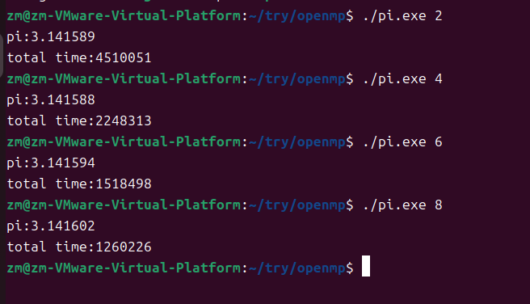

## 编译指导语句 ##
格式：`#pragma omp <directive>[clause[[,]clause]...]`
- directive部分是编译指导语句的主要指令，用来指导多个CPU共享任务或指导多个CPU同步
- clause部分是*可选*的子句，它给出了相应的指令参数，可以影响到编译指导语句的具体执行
注意：**换行符是必选项**。位于被这个指令包围的结构块之前，表示这条编译指导语句的终止。<即在编译语句结束后需要输入换行符>
- `<directive>`: 
     
|  指令  |   作用   |    
|----------|--------|    
| parallel |用在一个结构块之前，表示这段代码将被多个线程并行执行 |   
| for   |用于for循环语句之前，表示将循环计算任务分配到多个线程中并行执行，以实现任务分担，但必须保证每次循环之间无数据相关性|       
|sections |用在要被并行执行的代码段之前，用于实现多个结构块语句的任务分担，可并行执行的代码段各自用section指令标出<sections  vs  section>|     
|critical |用在一段代码临界区前，保证每次只有**一个openmp线程**进入|    
|single |用在并行域内，表示一段只**被单个进程执行**的代码 |    
|flush | 保证各个openmp线程的数据影像的一致性|     
|barrier|  用于并行域内代码的**线程同步**，线程执行到barrier时要停下等待，直到**所有线程都执行到barrier时才继续往下执行**|
- `[clause]`:   
   
|指令   |作用     |    
|----------|--------|    
| private | 指定一个或多个变量在每个线程中都有它自己的**私有副本**|    
|shared  | 指定一个或多个变量为多个线程间的**共享变量**|   
|default | 用来指定并行域内的变量的使用方式，缺省是shared|    
|firstprivate| 指定一个或多个变量在每个线程都有它自己的**私有副本**，并且私有变量要在进入并行域或任务分担域时，继承主线程中的**同名变量**的值作为初值|       
|lastprivate| 是用来指定将线程中的一个或多个私有变量的值在**并行处理结束后复制到主线程中的同名变量**中，负责拷贝的线程是for或sections任务分担中的最后一个线程 |   
|reduction |用来指定一个或多个变量是私有的，并且在并行处理结束后这些变量要执行指定的归约运算，并将结果返回给主线程同名变量 |     
|copyin |用来指定一个threadprivate类型的变量需要用主线程同名变量进行初始化|   
### 示例
- for[表示接下来的循环将被并行执行][前提是此区域已经被指令parallel初始化]
  ```C
  #pragma omp for
  ```
注意：
1. 循环应为单入口单出口，即使再break，goto后仍应再循环内部
2. 循环中的变量在没有特意说明的情况下是**共有的**，但循环中的次数**i**是私有的
- 嵌套循环
将`parallel for`置于循环前，则实现对**最近的循环语句**进行并行化
- collapse
在嵌套循环中，collapse可以使代码在不嵌套并行的情况下对多重循环进行并行。具体为将一个多重循环合并后，展开成为一个更大的循环，在线程组上划分调度的循环总数
```C
#pragma omp parallel for collapse(2) shared (a,b,c,M,N,P) private(j)//collapse(2)将M,P(i,k)的循环合并，成为M*P次
for(int i=0;i<M;i++)
for(int k=0;k<P;k++)
for(int j=0;j<N;j++)
c[i,k]=c[i,k]+a[i,j]*b[j+k];//再只合并两层循环的情况下不会发生数据竞争，但是如果把最后一层也进行合并，则会发生数据竞争
```
- 分段并行(sections)
主要用于非循环的代码并行。若不同的子任务之间不存在相互依赖的关系，可以将它们分配给不同的线程去执行。
```C
#pragma omp sections [private firstprivate lastprivate reduction nowait]
{
    #pragma omp section
    结构块
    #pragma omp section
    结构块
    //在pragma omp sections指令的范围中，不同的线程执行不同的section代码块
    //sections中的section进行并行处理
}
```
**例子try**
```C
#include<stdio.h>
#include<omp.h>
int main()
{
    int sum=0;
    #pragma omp sections reduction(+:sum)
    {
        #pragma omp section
        {
            int i;
            for(int i=0;i<5;i++){
                sum+=i;
            }
        }
        #pragma omp section
        {
            int i;
            for(int i=5;i<10;i++){
                sum+=i;
            }
        }
    }
    printf("sum:%d\n",sum);
    return 0;
}
```
- Single


## 私有变量的声明-数据环境
1. `private`私有变量//在并行区域中private变量的初始化于并行区域外的同名变量是不相关的，是各自**分离**开的；
2. `firstprivate`与上述的`private`是不同的在**同名变量**上，`firstprivate`私有变量会**继承**原始变量（即并行区域外的同名变量）
3. `lastprivate`是用来指定将线程中的一个或多个私有变量的值在**并行处理结束后复制到主线程中的同名变量**中，负责拷贝的线程是for或sections任务分担中的**最后一个线程**
   最后一个线程中同名变量为什么值，即会返回到主线程中为相对应的值
4. `reduction`规约操作：求和、求差、求积等操作
   `reduction(+:a)`注意reduction列表中的变量已经成为了私有变量，不需要再进行private的声明


# openmp实例演示
## 梯形积分法的并行化
```C
#include<stdio.h>
#include<omp.h>
#include<math.h>
#include<sys/time.h>
#define f(x) 1/(1+pow(x,2))
int main()
{
int thread_number=20;
float min=0;
float max=1000;
double interval=0;
int step=1e5;
int i;
interval=(max-min)/step;
struct timeval start,end;
long totaltime=0;
double result=0;
gettimeofday(&start,NULL);
#pragma omp parallel for reduction(+:result) num_threads(thread_number)
for(i=0;i<step;i++)
{
        result+=(f(min+i*interval)+f(min+(i+1)*interval))*interval/2;
}
gettimeofday(&end,NULL);
totaltime=1000000*(end.tv_sec-start.tv_sec)+(end.tv_usec-start.tv_usec);
printf("Calculated result: %lf\n",result);
printf("total used time is %ld\n",totaltime);
return 0;
}
```
```shell
gcc -fopenmp integral.c -o intergal.exe -lm//链接数学库
```

## 蒙特卡洛方法进行Π派值估计
影响因素：
1. private(x,y)//如果不给每个线程数分配自己的x，y则每个线程将会等上一个线程找公有变量x，y
2. 线程数
3. reduction
```C
#include<stdio.h>
#include<time.h>
#include<stdlib.h>//for atoi
#include<sys/time.h>
#include<omp.h>
int main(int argc,char*argv[])
{
//set threads
int tn=atoi(argv[1]);
int i=0;
int count=0;
double pi=0;
double x,y;
int n=1e9;
//time
struct timeval start,end;
long total_time;
gettimeofday(&start,NULL);
//openmp
#pragma omp parallel num_threads(tn)
{
//set seed forhead
unsigned seed=time(NULL)+omp_get_thread_num();
#pragma omp for reduction(+:count) private(x,y)
for(i=0;i<n;i++)
{
x=rand_r(&seed)/(double)RAND_MAX;
y=rand_r(&seed)/(double)RAND_MAX;//'/'for [0,1]
if(x*x+y*y<1)
        count++;
}
}
gettimeofday(&end,NULL);
pi=4.0*count/n;
total_time=1000000*(end.tv_sec-start.tv_sec)+(end.tv_usec-start.tv_usec);
printf("pi:%.6lf\n",pi);
printf("total time:%ld\n",total_time);
return 0;
}
```
1. 线程数的影响
                                                  
